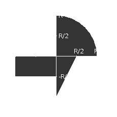

# spring_application

<h2>Разработать приложение, которое осуществляет проверку попадания точки в заданную область на координатной плоскости с использованием следующих технологий:</h2>

	1. Уровень back-end должен быть основан на Spring.
	2. Уровень front-end должен быть построен на Vue.js с использованием обычных полей ввода HTML
	3. Взаимодействие между уровнями back-end и front-end должно быть организовано посредством REST API.

<b>Стартовая страница должна содержать следующие элементы:</b>

	1. "Шапку", содержащую ФИО студента, номер группы и номер варианта.
	2. Форму для ввода логина и пароля. Информация о зарегистрированных в системе пользователях должна храниться в отдельной таблице БД (пароль должен храниться в виде хэш-суммы). Доступ неавторизованных пользователей к основной странице приложения должен быть запрещён.

<b>Основная страница приложения должна содержать следующие элементы:</b>

	1. Набор полей ввода для задания координат точки и радиуса области в соответствии с вариантом задания: Button {'-3','-2','-1','0','1','2','3','4','5'} для координаты по оси X, Text (-3 ... 5) для координаты по оси Y, и Button {'-3','-2','-1','0','1','2','3','4','5'} для задания радиуса области. Если поле ввода допускает ввод заведомо некорректных данных (таких, например, как буквы в координатах точки или отрицательный радиус), то приложение должно осуществлять их валидацию.
	2. Динамически обновляемую картинку, изображающую область на координатной плоскости в соответствии с номером варианта и точки, координаты которых были заданы пользователем. Клик по картинке должен инициировать сценарий, осуществляющий определение координат новой точки и отправку их на сервер для проверки её попадания в область. Цвет точек должен зависить от факта попадания / непопадания в область. Смена радиуса также должна инициировать перерисовку картинки.
	3. Таблицу со списком результатов предыдущих проверок.
	4. Ссылку, по которой аутентифицированный пользователь может закрыть свою сессию и вернуться на стартовую страницу приложения.


<b>Дополнительные требования к приложению:</b>

	1. Все результаты проверки должны сохраняться в базе данных под управлением СУБД PostgreSQL.
	2. Для доступа к БД необходимо использовать Spring Data.


---
# Запуск

1. Создать общую сеть под контейнеры.
```
sudo docker network create my_docker_network
```
2. Развернуть БД.
```
./db/run-docker.sh
```
3. Сбилдить back-end часть.
```
cd back-end
./build-docker.sh
```
4. Запустить back-end.
```
./run-docker.sh
cd ..
```
5. Запустить фронт.
```
cd front-end
npm install
npm start
```